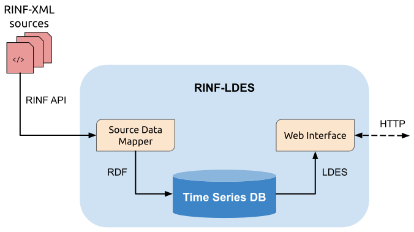

# RINF-LDES
[LDES (Linked Data Event Stream)](https://semiceu.github.io/LinkedDataEventStreams/) generation and publishing from ERA's [RINF (Registry of Infrastructure)](https://www.era.europa.eu/registers_en#rinf) data. 

This repository provides a Node.js application, composed of different modules which perform the following tasks:

- **Source Data Mapper:** This module is responsible for fetching the RINF-XML source files for every member state via the [RINF API](https://rinf.era.europa.eu/API/Help). Upon collection, source files are used as input for the RDF generation process using the [RML Mapper](https://github.com/RMLio/rmlmapper-java), and the resulting RDF data are serialized as JSON-LD and ingested into a local MongoDB instance. The RML engine includes an implementation of the approach described by Van Assche et al. to materialize only updated data (delta-based) objects across source releases.

- **Time Series DB**: This module is responsible for storing transformed source data updates following an append-only log strategy. The implementation is done by relying on [MongoDB Time Series collections](https://www.mongodb.com/docs/manual/core/timeseries-collections/) feature. MongoDB is optimized for storing and serving JSON data (in this case JSON-LD) and Time Series collections further optimize indexing tasks for immutable and time-varying data objects, which are characteristics of LDES-based data. 

- **Web Interface**: This module defines the Web HTTP interfaces that can be polled to request the different Linked Data fragments (or pages) that compose the LDES. For this pilot we define one LDES per member state with an available RINF-XML data source. In total we produce a Web interface for 26 different countries of the EU.